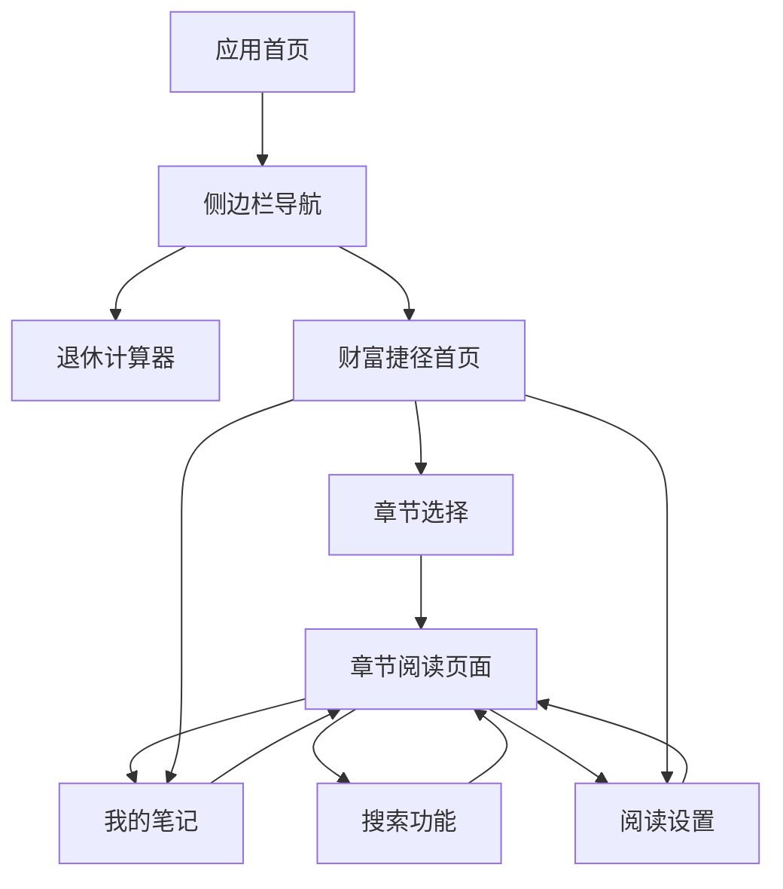

# 财富捷径阅读平台 - 产品需求文档

## 1. 产品概述

财富捷径阅读平台是在现有退休财务自由计算器基础上扩展的综合性理财工具平台，集成了专业的财务计算功能和深度阅读体验。

该平台旨在为用户提供一站式的财务规划和理财知识学习解决方案，通过将实用的计算工具与优质的理财书籍内容相结合，帮助用户更好地理解和实践财务自由之路。

目标是打造一个集工具性、知识性、实用性于一体的个人理财助手，为追求财务自由的用户提供全方位支持。

## 2. 核心功能

### 2.1 用户角色

考虑到书籍版权保护需求，本产品设计了简单的权限控制机制：

| 角色 | 访问方式 | 核心权限 |
|------|----------|----------|
| 普通访客 | 直接访问网站 | 只能使用退休计算器功能 |
| 授权用户 | 通过密码验证或邀请码 | 可以访问财富捷径阅读功能的完整内容 |

**权限验证机制**：
- 采用简单的密码验证或邀请码系统
- 验证成功后在本地存储授权状态
- 未授权用户访问阅读功能时显示权限提示页面
- 授权状态可设置有效期（可选功能）

### 2.2 功能模块

整体平台包含以下主要功能模块：

1. **退休计算器页面**：原有的财务计算功能，包括退休规划、投资收益计算等核心工具
2. **财富捷径阅读页面**：全新的阅读功能，提供《财富捷径》书籍的完整阅读体验
3. **全局导航系统**：统一的侧边栏导航，支持响应式设计
4. **全局设置系统**：包含夜间模式等全局配置选项

### 2.3 页面详情

| 页面名称 | 模块名称 | 功能描述 |
|---------|---------|----------|
| 主导航页面 | 侧边栏导航 | 提供"退休计算器"和"财富捷径"两个主要入口，支持折叠展开，响应式适配 |
| 退休计算器页面 | 财务计算工具 | 保持原有功能不变，包括收入支出计算、投资规划、退休时间预测等 |
| 财富捷径首页 | 阅读导航中心 | 展示章节目录、阅读进度、快速访问我的笔记和设置 |
| 章节阅读页面 | 内容展示区域 | 显示EPUB解析后的章节内容，支持文本选择、划线、笔记添加 |
| 章节阅读页面 | 阅读工具栏 | 提供字体大小调节、阅读进度显示、目录导航、搜索入口 |
| 我的笔记页面 | 笔记管理 | 展示所有划线内容和笔记，支持按章节分类、搜索过滤、编辑删除 |
| 搜索结果页面 | 全文搜索 | 显示搜索结果，高亮匹配文本，提供章节定位和上下文预览 |
| 阅读设置页面 | 个性化配置 | 提供字体设置、行间距调节、页面宽度等阅读体验优化选项 |

## 3. 核心流程

### 3.1 主要用户操作流程

**阅读流程**：
用户通过侧边栏进入财富捷径 → 选择章节开始阅读 → 在阅读过程中进行划线和笔记 → 通过目录导航或搜索功能快速定位内容 → 在我的笔记中回顾和管理划线内容

**设置流程**：
用户在任意页面切换夜间模式（全局生效） → 在阅读设置中调整字体和布局偏好 → 设置自动保存到本地存储

**搜索流程**：
用户在阅读页面或笔记页面发起搜索 → 系统在全书内容中匹配关键词 → 展示搜索结果并高亮匹配文本 → 用户点击结果直接跳转到对应章节位置

### 3.2 页面导航流程图

## 4. 用户界面设计

### 4.1 设计风格

- **主色调**：保持与现有计算器一致的蓝色系（#1890ff）作为主色，白色/灰色作为辅助色
- **夜间模式**：深色背景（#141414）配合浅色文字（#ffffff），护眼的暖色调（#f0f0f0）用于阅读文本
- **按钮样式**：圆角设计，与Ant Design组件库保持一致
- **字体**：系统默认字体，阅读区域支持用户自定义字体大小（14px-24px）
- **布局风格**：左侧固定导航栏 + 右侧主内容区域，卡片式内容展示
- **图标风格**：使用Ant Design图标库，简洁现代的线性图标

### 4.2 页面设计概览

| 页面名称 | 模块名称 | UI元素 |
|---------|---------|--------|
| 侧边栏导航 | 主导航菜单 | 深色背景，白色图标和文字，hover效果，折叠动画，响应式断点240px宽度 |
| 财富捷径首页 | 章节目录卡片 | 网格布局，每个章节显示标题、阅读进度条、最后阅读时间，卡片阴影效果 |
| 章节阅读页面 | 内容展示区 | 最大宽度800px居中，行间距1.6，段落间距适中，划线高亮显示黄色背景 |
| 章节阅读页面 | 工具栏 | 固定在页面顶部，包含返回、目录、搜索、设置按钮，半透明背景 |
| 我的笔记页面 | 笔记列表 | 时间线布局，每条笔记显示划线文本、章节信息、创建时间，支持编辑和删除 |
| 搜索结果页面 | 结果列表 | 列表布局，高亮匹配关键词，显示上下文片段，章节标签，点击跳转 |

### 4.3 响应式设计

- **桌面优先**：主要针对桌面端阅读体验优化
- **移动端适配**：屏幕宽度小于768px时，侧边栏自动收起为顶部汉堡菜单
- **触摸优化**：移动端增大点击区域，优化滑动和缩放手势
- **阅读体验**：移动端自动调整字体大小和行间距，确保舒适的阅读体验

## 5. 技术需求

### 5.1 EPUB文件处理

- 解析EPUB文件结构，提取HTML章节内容
- 保持原有的文本格式和层次结构
- 支持章节导航和内容索引
- 处理图片和样式资源（如有）

### 5.2 划线功能技术要求

- 实现文本选择检测和范围记录
- 高亮显示选中文本（黄色背景）
- 本地存储划线数据（localStorage）
- 支持划线的添加、删除和编辑
- 处理跨段落划线的边界情况

### 5.3 搜索功能技术要求

- 全文索引构建和关键词匹配
- 搜索结果高亮显示
- 支持模糊搜索和精确匹配
- 搜索结果按相关性排序
- 提供搜索历史记录

### 5.4 数据存储要求

- 使用localStorage存储用户设置、阅读进度、划线数据
- 数据结构设计支持版本兼容和迁移
- 实现数据的导入导出功能（可选）
- 确保数据的完整性和一致性

### 5.5 性能要求

- 章节内容懒加载，提升首屏加载速度
- 搜索响应时间控制在500ms以内
- 划线操作实时响应，无明显延迟
- 支持大文件处理，单章节最大支持100KB文本

### 5.6 兼容性要求

- 支持现代浏览器（Chrome 80+, Firefox 75+, Safari 13+）
- 移动端浏览器兼容（iOS Safari, Android Chrome）
- 确保在不同设备和屏幕尺寸下的一致体验

### 5.7 代码质量要求

- **注释规范**：所有代码必须包含简单易懂的中文注释
- **UI组件注释**：特别重视用户界面相关代码的注释说明
  - 组件功能说明
  - 重要props参数解释
  - 复杂交互逻辑的步骤说明
  - 样式和布局的设计意图
- **代码可读性**：变量和函数命名要清晰明确
- **文档维护**：重要功能模块需要配套的README说明

### 5.8 权限控制技术要求

- 实现简单的前端权限验证机制
- 支持密码验证或邀请码两种授权方式
- 授权状态本地存储和过期管理
- 未授权访问的友好提示界面
- 权限验证组件的复用性设计