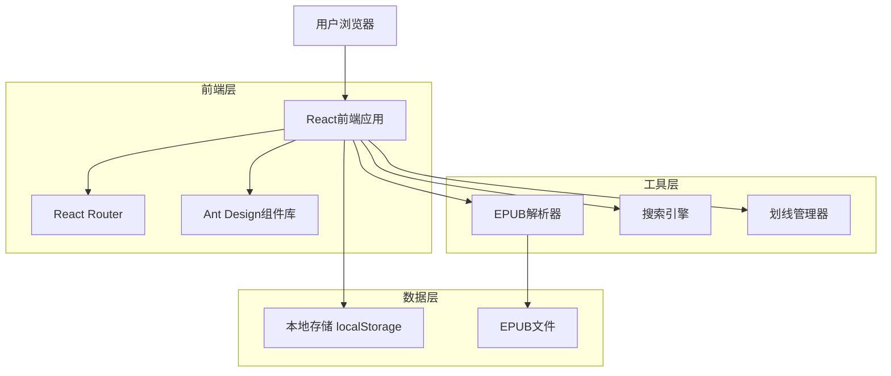
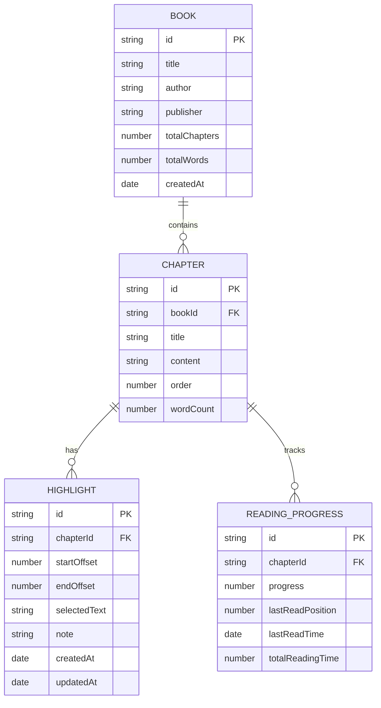

# 财富捷径阅读平台 - 技术架构文档

## 1. 架构设计



## 2. 技术描述

- **前端**: React@18 + TypeScript + Ant Design@5 + React Router@6 + Vite
- **样式**: Tailwind CSS@3 + Ant Design主题定制
- **状态管理**: React Context + useState/useReducer
- **数据存储**: 浏览器localStorage（无需后端数据库）
- **构建工具**: Vite + TypeScript + ESLint

## 3. 路由定义

| 路由 | 用途 |
|------|------|
| / | 应用首页，默认重定向到退休计算器 |
| /calculator | 退休计算器页面，保持原有功能 |
| /wealth-shortcut | 财富捷径首页，显示章节目录和导航 |
| /wealth-shortcut/chapter/:id | 章节阅读页面，显示具体章节内容 |
| /wealth-shortcut/notes | 我的笔记页面，管理所有划线和笔记 |
| /wealth-shortcut/search | 搜索结果页面，显示全文搜索结果 |
| /wealth-shortcut/settings | 阅读设置页面，个性化配置选项 |

## 4. 核心模块设计

### 4.1 EPUB解析模块

```typescript
// EPUB解析器接口
interface EpubParser {
  parseEpub(file: File): Promise<BookData>
  extractChapters(epubData: any): Chapter[]
  extractMetadata(epubData: any): BookMetadata
}

// 章节数据结构
interface Chapter {
  id: string
  title: string
  content: string
  order: number
  wordCount: number
}

// 书籍元数据
interface BookMetadata {
  title: string
  author: string
  publisher?: string
  totalChapters: number
  totalWords: number
}
```

### 4.2 划线功能模块

```typescript
// 划线数据结构
interface Highlight {
  id: string
  chapterId: string
  startOffset: number
  endOffset: number
  selectedText: string
  note?: string
  createdAt: Date
  updatedAt: Date
}

// 划线管理器
interface HighlightManager {
  createHighlight(selection: Selection, chapterId: string): Highlight
  deleteHighlight(highlightId: string): void
  updateHighlight(highlightId: string, updates: Partial<Highlight>): void
  getHighlightsByChapter(chapterId: string): Highlight[]
  getAllHighlights(): Highlight[]
}
```

### 4.3 搜索功能模块

```typescript
// 搜索结果结构
interface SearchResult {
  chapterId: string
  chapterTitle: string
  matchedText: string
  context: string
  position: number
  relevanceScore: number
}

// 搜索引擎接口
interface SearchEngine {
  indexContent(chapters: Chapter[]): void
  search(query: string): SearchResult[]
  highlightMatches(text: string, query: string): string
}
```

### 4.4 阅读进度模块

```typescript
// 阅读进度数据
interface ReadingProgress {
  chapterId: string
  progress: number // 0-100百分比
  lastReadPosition: number
  lastReadTime: Date
  totalReadingTime: number // 秒
}

// 进度管理器
interface ProgressManager {
  updateProgress(chapterId: string, position: number): void
  getProgress(chapterId: string): ReadingProgress
  getOverallProgress(): number
}
```

## 5. 数据模型

### 5.1 数据模型定义



### 5.2 本地存储数据结构

```typescript
// localStorage数据结构
interface LocalStorageData {
  // 应用设置
  appSettings: {
    theme: 'light' | 'dark'
    fontSize: number
    lineHeight: number
    pageWidth: number
    autoSave: boolean
  }
  
  // 书籍数据
  bookData: {
    metadata: BookMetadata
    chapters: Chapter[]
    lastUpdated: Date
  }
  
  // 用户数据
  userData: {
    highlights: Highlight[]
    progress: ReadingProgress[]
    searchHistory: string[]
    bookmarks: string[] // 章节ID列表
  }
}

// 存储键名定义
const STORAGE_KEYS = {
  APP_SETTINGS: 'wealth-shortcut-settings',
  BOOK_DATA: 'wealth-shortcut-book',
  USER_DATA: 'wealth-shortcut-user-data'
} as const
```

## 6. 组件架构

### 6.1 组件层次结构

```
App
├── Layout
│   ├── Sidebar (侧边栏导航)
│   ├── Header (顶部工具栏)
│   └── Content (主内容区)
├── Routes
│   ├── CalculatorPage (计算器页面)
│   └── WealthShortcutRoutes
│       ├── HomePage (首页)
│       ├── ChapterPage (章节阅读)
│       ├── NotesPage (笔记管理)
│       ├── SearchPage (搜索结果)
│       └── SettingsPage (设置页面)
└── Providers
    ├── ThemeProvider (主题管理)
    ├── BookProvider (书籍数据)
    └── UserDataProvider (用户数据)
```

### 6.2 核心组件设计

```typescript
// 章节阅读组件
interface ChapterReaderProps {
  chapterId: string
  content: string
  highlights: Highlight[]
  onHighlight: (highlight: Highlight) => void
  onProgressUpdate: (progress: number) => void
}

// 划线工具组件
interface HighlightToolProps {
  selectedText: string
  position: { x: number; y: number }
  onSave: (note?: string) => void
  onCancel: () => void
}

// 搜索组件
interface SearchComponentProps {
  onSearch: (query: string) => void
  results: SearchResult[]
  loading: boolean
  onResultClick: (result: SearchResult) => void
}
```

## 7. 性能优化策略

### 7.1 代码分割
- 使用React.lazy()对路由组件进行懒加载
- EPUB解析器作为独立模块按需加载
- 搜索功能模块延迟初始化

### 7.2 内容优化
- 章节内容虚拟化，大章节分页显示
- 搜索索引增量构建和缓存
- 图片懒加载和压缩

### 7.3 缓存策略
- 解析后的章节内容缓存到localStorage
- 搜索索引本地缓存
- 组件级别的memo优化

## 8. 部署和构建

### 8.1 构建配置
```javascript
// vite.config.ts 关键配置
export default defineConfig({
  build: {
    rollupOptions: {
      output: {
        manualChunks: {
          vendor: ['react', 'react-dom', 'antd'],
          epub: ['epub-parser'], // EPUB解析相关
          search: ['fuse.js'] // 搜索引擎
        }
      }
    },
    chunkSizeWarningLimit: 1000
  }
})
```

### 8.2 环境要求
- Node.js 18+
- 现代浏览器支持ES2020+
- 本地存储空间至少50MB（用于缓存书籍内容）

### 8.3 部署策略
- 静态文件部署到Vercel/Netlify
- 启用Gzip压缩和缓存策略
- PWA支持（可选，用于离线阅读）