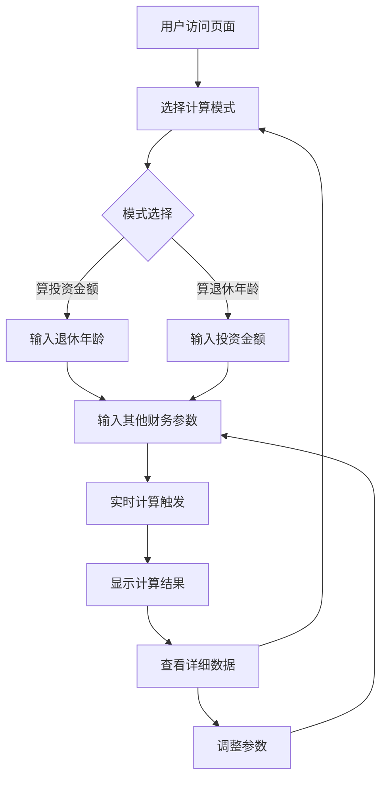

# 退休财务自由计算器 - 产品需求文档

## 1. 产品概述

退休财务自由计算器是一个单页网页应用，提供两种计算模式帮助用户进行退休财务规划。基于科学的财务规划公式，为用户提供个性化的退休投资建议。

该产品解决了个人退休规划中的两个核心问题：1）需要多少年度投资才能在退休时达到财务自由；2）按照当前投资能力，多少年后可以退休。通过灵活的双模式设计，满足不同用户的计算需求。

## 2. 核心功能

### 2.1 功能模块

我们的退休财务自由计算器包含以下主要页面：
1. **计算器主页面**：计算模式切换器、参数输入区域、实时计算引擎、结果展示区域、错误提示模块。

### 2.2 计算模式

系统提供两种计算模式，用户可通过顶部切换器选择：

| 模式名称 | 输入参数 | 计算结果 | 适用场景 |
|---------|---------|----------|----------|
| 算投资金额 | 计划退休年龄 + 其他财务参数 | 每年/每月需要投资的金额 | 已确定退休年龄，想知道需要投资多少 |
| 算退休年龄 | 每月可投资金额 + 其他财务参数 | 距离退休还有多少年，退休时的年龄 | 已确定投资能力，想知道何时可以退休 |

### 2.3 页面详情

| 页面名称 | 模块名称 | 功能描述 |
|---------|---------|----------|
| 计算器主页面 | 计算模式切换器 | 顶部Segmented组件，提供"算投资金额"和"算退休年龄"两个选项，切换时动态更新输入字段和结果展示 |
| 计算器主页面 | 参数输入区域 | 根据选择模式动态显示输入字段。算投资金额模式：当前年龄、计划退休年龄、财务参数8项；算退休年龄模式：当前年龄、每月可投资金额、财务参数8项 |
| 计算器主页面 | 实时计算引擎 | 监听输入变化和模式切换，自动触发对应计算逻辑。算投资金额：正向计算年度投资额；算退休年龄：反向计算投资年数 |
| 计算器主页面 | 结果展示区域 | 根据模式显示不同主要结果。算投资金额模式：突出显示每年/每月需投资金额；算退休年龄模式：突出显示距离退休年数和退休时年龄 |
| 计算器主页面 | 错误提示模块 | 根据不同模式验证输入有效性，提供相应错误提示 |

## 3. 核心流程

### 3.1 算投资金额模式流程
用户访问计算器页面 → 选择"算投资金额"模式 → 输入计划退休年龄和财务参数 → 系统计算每年/每月需投资金额 → 查看详细计算过程 → 调整参数优化方案。

### 3.2 算退休年龄模式流程
用户访问计算器页面 → 选择"算退休年龄"模式 → 输入每月可投资金额和财务参数 → 系统反向计算退休年数 → 查看退休时年龄和详细数据 → 调整投资金额测试不同方案。

### 3.3 整体交互流程



## 4. 用户界面设计

### 4.1 设计风格

- 主色调：深蓝色(#1e3a8a)和金色(#f59e0b)，体现专业和财富主题
- 辅助色：浅灰色(#f3f4f6)背景，白色(#ffffff)卡片
- 按钮样式：圆角矩形，渐变效果，悬停状态变化
- 字体：系统默认字体，标题18-24px，正文14-16px
- 布局风格：卡片式设计，左右分栏布局（桌面端），单列布局（移动端）
- 图标风格：线性图标，财务相关符号（💰、📊、🎯）

### 4.2 页面设计概览

| 页面名称 | 模块名称 | UI元素 |
|---------|---------|--------|
| 计算器主页面 | 计算模式切换器 | 页面顶部居中，Segmented分段控制器，蓝色主题，"算投资金额"和"算退休年龄"两个选项，切换时有平滑动画效果 |
| 计算器主页面 | 参数输入区域 | 左侧卡片布局，根据模式动态显示8-9个输入框，每个输入框包含标签、单位提示、工具提示图标，网格布局排列，圆角边框设计 |
| 计算器主页面 | 结果展示区域 | 右侧卡片布局，根据模式显示不同主要结果。算投资金额：突出显示年度/月度投资金额；算退休年龄：突出显示退休年数和年龄，下方展示详细计算数据 |
| 计算器主页面 | 错误提示模块 | 红色边框高亮错误输入框，输入框下方显示红色错误文本，根据不同模式提供相应的验证规则和错误提示 |

### 4.3 响应式设计

产品采用移动优先的响应式设计，桌面端使用左右分栏布局（输入区域在左，结果在右），移动端采用上下单列布局，支持触摸交互优化，确保在各种设备上都有良好的用户体验。模式切换器在所有设备上都保持顶部居中位置。

## 5. 技术实现方案

### 5.1 反向计算数学逻辑

**算退休年龄模式**的核心是根据每月投资金额反推投资年数，基于以下数学关系：

#### 5.1.1 核心公式推导

正向计算公式：
```
年度投资额 = 资金缺口 / P值
P值 = [(1+i)^N - 1] / i * (1+i)
```

反向计算需要求解：
```
已知：年度投资额 = 每月投资额 × 12
求解：投资年数 N
```

#### 5.1.2 数值求解方法

由于P值公式包含指数函数，无法直接求解析解，采用**二分查找法**：

1. **初始范围**：N ∈ [1, 50] 年
2. **迭代条件**：|计算投资额 - 目标投资额| < 0.01
3. **收敛判断**：最大迭代次数 100 次

#### 5.1.3 算法步骤

```
1. 设置搜索范围：minYears = 1, maxYears = 50
2. 计算中点：midYears = (minYears + maxYears) / 2
3. 使用midYears计算所需年度投资额
4. 比较计算结果与用户输入的投资额：
   - 如果计算投资额 > 用户投资额：minYears = midYears
   - 如果计算投资额 < 用户投资额：maxYears = midYears
5. 重复步骤2-4直到收敛
6. 返回：退休年数 = midYears，退休年龄 = 当前年龄 + midYears
```

### 5.2 数据结构扩展

#### 5.2.1 计算模式枚举
```typescript
enum CalculationMode {
  CALCULATE_INVESTMENT = 'calculate_investment',
  CALCULATE_RETIREMENT_AGE = 'calculate_retirement_age'
}
```

#### 5.2.2 参数接口扩展
```typescript
interface CalculationParams {
  // 现有字段保持不变
  currentAge: number;
  retirementAge?: number; // 算投资金额模式必填
  monthlyInvestment?: number; // 算退休年龄模式必填
  // ... 其他财务参数
}
```

#### 5.2.3 结果接口扩展
```typescript
interface CalculationResult {
  // 现有字段保持不变
  // 新增字段
  calculatedRetirementAge?: number; // 算退休年龄模式结果
  yearsToRetirement: number; // 两种模式都需要
}
```

### 5.3 实现优先级

1. **阶段一**：UI模式切换器和动态表单
2. **阶段二**：反向计算数学逻辑实现
3. **阶段三**：结果展示优化和验证规则完善
4. **阶段四**：用户体验优化和错误处理