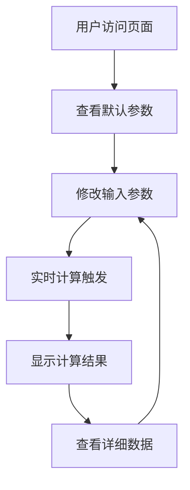

# 退休财务自由计算器 - 产品需求文档

## 1. 产品概述

退休财务自由计算器是一个单页网页应用，帮助用户计算为实现退休财务自由所需的年度投资金额。基于科学的财务规划公式，为用户提供个性化的退休投资建议。

该产品解决了个人退休规划中的核心问题：需要多少年度投资才能在退休时达到财务自由。通过输入个人财务状况和退休目标，用户可以获得精确的投资指导。

## 2. 核心功能

### 2.1 功能模块

我们的退休财务自由计算器包含以下主要页面：
1. **计算器主页面**：参数输入区域、实时计算引擎、结果展示区域、错误提示模块。

### 2.2 页面详情

| 页面名称 | 模块名称 | 功能描述 |
|---------|---------|----------|
| 计算器主页面 | 参数输入区域 | 提供9个可修改的输入字段，包含默认值：当前年龄(25)、计划退休年龄(45)、当前年生活开支(180000元)、当前被动年收入(0元)、预计退休后其他被动年收入(40000元)、当前已投资金融资产(110000元)、预计年通货膨胀率(4%)、投资年化收益率(10%)、退休后生活开支比例(80%)、退休后资产年提取率(4%) |
| 计算器主页面 | 实时计算引擎 | 监听输入变化，自动触发9步计算公式：计算退休年数、通胀因子、退休时年开支、退休时被动收入、需投资覆盖开支、退休所需总资产、当前资产未来价值、资金缺口、年度投资额 |
| 计算器主页面 | 结果展示区域 | 突出显示最终结果（每年需投资金额），展示关键中间计算结果：退休年数(N)、通胀因子(INF)、退休时年开支、退休所需总资产(F)、当前资产未来价值、资金缺口(D)、使用的累计投资倍数(P值) |
| 计算器主页面 | 错误提示模块 | 验证输入有效性，对无效输入提供错误提示（如退休年龄小于当前年龄、负数输入等） |

## 3. 核心流程

用户访问计算器页面 → 查看默认参数值 → 根据个人情况修改输入参数 → 系统实时计算并显示结果 → 用户查看年度投资金额和详细计算过程 → 根据结果调整参数进行多次计算对比。

## 4. 用户界面设计

### 4.1 设计风格

- 主色调：深蓝色(#1e3a8a)和金色(#f59e0b)，体现专业和财富主题
- 辅助色：浅灰色(#f3f4f6)背景，白色(#ffffff)卡片
- 按钮样式：圆角矩形，渐变效果，悬停状态变化
- 字体：系统默认字体，标题18-24px，正文14-16px
- 布局风格：卡片式设计，左右分栏布局（桌面端），单列布局（移动端）
- 图标风格：线性图标，财务相关符号（💰、📊、🎯）

### 4.2 页面设计概览

| 页面名称 | 模块名称 | UI元素 |
|---------|---------|--------|
| 计算器主页面 | 参数输入区域 | 左侧卡片布局，9个标签化输入框，每个输入框包含标签、单位提示、默认值，使用网格布局排列，输入框采用圆角边框设计 |
| 计算器主页面 | 结果展示区域 | 右侧卡片布局，顶部突出显示年度投资金额（大字体、金色背景），下方展示中间计算结果（表格形式），使用进度条或图表可视化关键数据 |
| 计算器主页面 | 错误提示模块 | 红色边框高亮错误输入框，输入框下方显示红色错误文本，页面顶部显示全局错误提示横幅 |

### 4.3 响应式设计

产品采用移动优先的响应式设计，桌面端使用左右分栏布局（输入区域在左，结果在右），移动端采用上下单列布局，支持触摸交互优化，确保在各种设备上都有良好的用户体验。