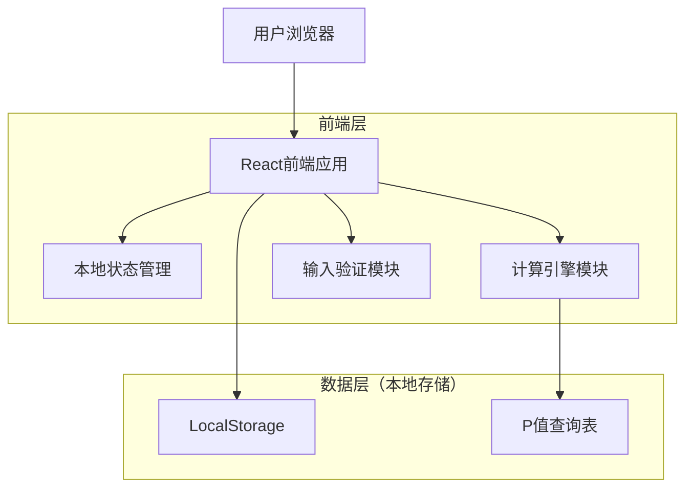
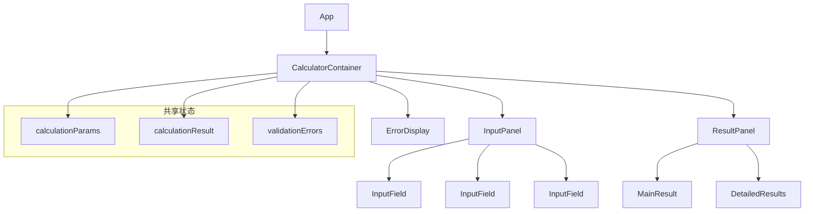

# 退休财务自由计算器 - 技术架构文档

## 1. 架构设计



## 2. 技术描述

- 前端：React@18 + TypeScript + Tailwind CSS@3 + Vite
- 状态管理：React Hooks (useState, useEffect)
- 构建工具：Vite
- 部署：静态网站托管

## 3. 路由定义

| 路由 | 用途 |
|------|------|
| / | 计算器主页面，包含所有输入参数、计算逻辑和结果展示 |

## 4. 核心模块设计

### 4.1 计算引擎模块

```typescript
// 计算参数接口
interface CalculationParams {
  currentAge: number;
  retirementAge: number;
  currentAnnualExpense: number;
  currentPassiveIncome: number;
  expectedRetirementPassiveIncome: number;
  currentInvestmentAssets: number;
  inflationRate: number;
  investmentReturn: number;
  retirementExpenseRatio: number;
  withdrawalRate: number;
}

// 计算结果接口
interface CalculationResult {
  yearsToRetirement: number;
  inflationFactor: number;
  retirementAnnualExpense: number;
  retirementPassiveIncome: number;
  investmentNeededToCoverExpense: number;
  totalAssetsNeeded: number;
  currentAssetsFutureValue: number;
  fundingGap: number;
  pValue: number;
  annualInvestmentNeeded: number;
}
```

### 4.2 P值查询表

```typescript
const P_VALUE_TABLE: Record<number, number> = {
  5: 7.7,    // 60岁退休
  10: 18.5,  // 55岁退休
  15: 36,    // 50岁退休
  20: 64,    // 45岁退休
  25: 109,   // 40岁退休
  30: 182,   // 35岁退休
  35: 299,   // 30岁退休
  40: 488    // 25岁退休
};

// P值查询函数
function getPValue(yearsToRetirement: number): number {
  const availableYears = Object.keys(P_VALUE_TABLE)
    .map(Number)
    .sort((a, b) => a - b);
  
  // 找到最接近且不大于目标年数的值
  for (let i = availableYears.length - 1; i >= 0; i--) {
    if (yearsToRetirement >= availableYears[i]) {
      return P_VALUE_TABLE[availableYears[i]];
    }
  }
  
  // 如果小于最小值，返回最小值对应的P值
  return P_VALUE_TABLE[availableYears[0]];
}
```

### 4.3 计算逻辑实现

```typescript
function calculateRetirementInvestment(params: CalculationParams): CalculationResult {
  // 1. 退休年数(N)
  const yearsToRetirement = params.retirementAge - params.currentAge;
  
  // 2. 通胀因子(INF)
  const inflationFactor = Math.pow(1 + params.inflationRate / 100, yearsToRetirement);
  
  // 3. 退休时年开支
  const retirementAnnualExpense = params.currentAnnualExpense * inflationFactor * (params.retirementExpenseRatio / 100);
  
  // 4. 退休时被动收入
  const retirementPassiveIncome = (params.currentPassiveIncome * inflationFactor) + params.expectedRetirementPassiveIncome;
  
  // 5. 需投资覆盖开支
  const investmentNeededToCoverExpense = retirementAnnualExpense - retirementPassiveIncome;
  
  // 6. 退休所需总资产(F)
  const totalAssetsNeeded = investmentNeededToCoverExpense / (params.withdrawalRate / 100);
  
  // 7. 当前资产未来价值
  const currentAssetsFutureValue = params.currentInvestmentAssets * Math.pow(1 + params.investmentReturn / 100, yearsToRetirement);
  
  // 8. 资金缺口(D)
  const fundingGap = totalAssetsNeeded - currentAssetsFutureValue;
  
  // 9. 获取P值
  const pValue = getPValue(yearsToRetirement);
  
  // 10. 年度投资额(Y)
  const annualInvestmentNeeded = fundingGap / pValue;
  
  return {
    yearsToRetirement,
    inflationFactor,
    retirementAnnualExpense,
    retirementPassiveIncome,
    investmentNeededToCoverExpense,
    totalAssetsNeeded,
    currentAssetsFutureValue,
    fundingGap,
    pValue,
    annualInvestmentNeeded
  };
}
```

## 5. 输入验证规则

```typescript
interface ValidationRule {
  field: keyof CalculationParams;
  validate: (value: number, params: CalculationParams) => string | null;
}

const VALIDATION_RULES: ValidationRule[] = [
  {
    field: 'currentAge',
    validate: (value) => {
      if (value < 18 || value > 100) return '当前年龄必须在18-100岁之间';
      return null;
    }
  },
  {
    field: 'retirementAge',
    validate: (value, params) => {
      if (value <= params.currentAge) return '退休年龄必须大于当前年龄';
      if (value > 100) return '退休年龄不能超过100岁';
      return null;
    }
  },
  {
    field: 'currentAnnualExpense',
    validate: (value) => {
      if (value < 0) return '年生活开支不能为负数';
      return null;
    }
  },
  {
    field: 'inflationRate',
    validate: (value) => {
      if (value < 0 || value > 20) return '通胀率应在0-20%之间';
      return null;
    }
  },
  {
    field: 'investmentReturn',
    validate: (value) => {
      if (value < 0 || value > 30) return '投资收益率应在0-30%之间';
      return null;
    }
  }
];
```

## 6. 组件架构



## 7. 性能优化策略

- 使用 React.memo 优化组件重渲染
- 使用 useMemo 缓存计算结果
- 使用 useCallback 优化事件处理函数
- 实现输入防抖，避免频繁计算
- 使用 LocalStorage 保存用户输入，提升用户体验