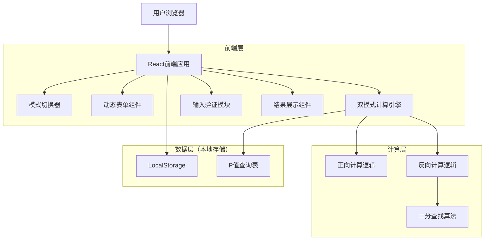

# 退休财务自由计算器 - 技术架构文档

## 1. 架构设计



## 2. 技术描述

- 前端：React@18 + TypeScript + Tailwind CSS@3 + Vite
- 状态管理：React Hooks (useState, useEffect)
- 构建工具：Vite
- 部署：静态网站托管

## 3. 路由定义

| 路由 | 用途 |
|------|------|
| / | 计算器主页面，包含所有输入参数、计算逻辑和结果展示 |

## 4. 核心模块设计

### 4.1 双模式计算引擎

```typescript
// 计算模式枚举
enum CalculationMode {
  CALCULATE_INVESTMENT = 'calculate_investment',
  CALCULATE_RETIREMENT_AGE = 'calculate_retirement_age'
}

// 扩展的计算参数接口
interface CalculationParams {
  currentAge: number;
  retirementAge?: number; // 算投资金额模式必填
  monthlyInvestment?: number; // 算退休年龄模式必填
  currentAnnualExpense: number;
  currentPassiveIncome: number;
  expectedRetirementPassiveIncome: number;
  currentInvestmentAssets: number;
  inflationRate: number;
  investmentReturn: number;
  retirementExpenseRatio: number;
  withdrawalRate: number;
}

// 扩展的计算结果接口
interface CalculationResult {
  mode: CalculationMode;
  yearsToRetirement: number;
  calculatedRetirementAge?: number; // 算退休年龄模式结果
  inflationFactor: number;
  retirementAnnualExpense: number;
  retirementPassiveIncome: number;
  investmentNeededToCoverExpense: number;
  totalAssetsNeeded: number;
  currentAssetsFutureValue: number;
  fundingGap: number;
  pValue: number;
  annualInvestmentNeeded: number;
}
```

### 4.2 P值查询表

```typescript
const P_VALUE_TABLE: Record<number, number> = {
  5: 7.7,    // 60岁退休
  10: 18.5,  // 55岁退休
  15: 36,    // 50岁退休
  20: 64,    // 45岁退休
  25: 109,   // 40岁退休
  30: 182,   // 35岁退休
  35: 299,   // 30岁退休
  40: 488    // 25岁退休
};

// P值查询函数
function getPValue(yearsToRetirement: number): number {
  const availableYears = Object.keys(P_VALUE_TABLE)
    .map(Number)
    .sort((a, b) => a - b);
  
  // 找到最接近且不大于目标年数的值
  for (let i = availableYears.length - 1; i >= 0; i--) {
    if (yearsToRetirement >= availableYears[i]) {
      return P_VALUE_TABLE[availableYears[i]];
    }
  }
  
  // 如果小于最小值，返回最小值对应的P值
  return P_VALUE_TABLE[availableYears[0]];
}
```

### 4.3 双模式计算逻辑实现

#### 4.3.1 正向计算（算投资金额模式）

```typescript
function calculateInvestmentAmount(params: CalculationParams): CalculationResult {
  // 1. 退休年数(N)
  const yearsToRetirement = params.retirementAge! - params.currentAge;
  
  // 2. 通胀因子(INF)
  const inflationFactor = Math.pow(1 + params.inflationRate / 100, yearsToRetirement);
  
  // 3. 退休时年开支
  const retirementAnnualExpense = params.currentAnnualExpense * inflationFactor * (params.retirementExpenseRatio / 100);
  
  // 4. 退休时被动收入
  const retirementPassiveIncome = (params.currentPassiveIncome * inflationFactor) + params.expectedRetirementPassiveIncome;
  
  // 5. 需投资覆盖开支
  const investmentNeededToCoverExpense = retirementAnnualExpense - retirementPassiveIncome;
  
  // 6. 退休所需总资产(F)
  const totalAssetsNeeded = investmentNeededToCoverExpense / (params.withdrawalRate / 100);
  
  // 7. 当前资产未来价值
  const currentAssetsFutureValue = params.currentInvestmentAssets * Math.pow(1 + params.investmentReturn / 100, yearsToRetirement);
  
  // 8. 资金缺口(D)
  const fundingGap = totalAssetsNeeded - currentAssetsFutureValue;
  
  // 9. 获取P值
  const pValue = getPValue(yearsToRetirement);
  
  // 10. 年度投资额(Y)
  const annualInvestmentNeeded = fundingGap / pValue;
  
  return {
    mode: CalculationMode.CALCULATE_INVESTMENT,
    yearsToRetirement,
    inflationFactor,
    retirementAnnualExpense,
    retirementPassiveIncome,
    investmentNeededToCoverExpense,
    totalAssetsNeeded,
    currentAssetsFutureValue,
    fundingGap,
    pValue,
    annualInvestmentNeeded
  };
}
```

#### 4.3.2 反向计算（算退休年龄模式）

```typescript
function calculateRetirementAge(params: CalculationParams): CalculationResult {
  const targetAnnualInvestment = params.monthlyInvestment! * 12;
  
  // 使用二分查找法求解退休年数
  let minYears = 1;
  let maxYears = 50;
  let bestYears = minYears;
  const tolerance = 0.01; // 容差
  
  while (maxYears - minYears > tolerance) {
    const midYears = (minYears + maxYears) / 2;
    const testRetirementAge = params.currentAge + midYears;
    
    // 使用当前年数计算所需投资额
    const testParams = {
      ...params,
      retirementAge: testRetirementAge
    };
    
    const result = calculateInvestmentAmount(testParams);
    
    if (result.annualInvestmentNeeded <= targetAnnualInvestment) {
      // 所需投资额小于等于目标，可以更早退休
      maxYears = midYears;
      bestYears = midYears;
    } else {
      // 所需投资额大于目标，需要延后退休
      minYears = midYears;
    }
  }
  
  const calculatedRetirementAge = params.currentAge + bestYears;
  
  // 使用最终结果重新计算完整数据
  const finalParams = {
    ...params,
    retirementAge: calculatedRetirementAge
  };
  
  const finalResult = calculateInvestmentAmount(finalParams);
  
  return {
    ...finalResult,
    mode: CalculationMode.CALCULATE_RETIREMENT_AGE,
    calculatedRetirementAge: Math.round(calculatedRetirementAge)
  };
}
```

#### 4.3.3 统一计算入口

```typescript
function calculate(params: CalculationParams, mode: CalculationMode): CalculationResult {
  switch (mode) {
    case CalculationMode.CALCULATE_INVESTMENT:
      return calculateInvestmentAmount(params);
    case CalculationMode.CALCULATE_RETIREMENT_AGE:
      return calculateRetirementAge(params);
    default:
      throw new Error('未知的计算模式');
  }
}
```

## 5. UI组件设计

### 5.1 模式切换器组件

```typescript
interface ModeToggleProps {
  mode: CalculationMode;
  onChange: (mode: CalculationMode) => void;
}

const ModeToggle: React.FC<ModeToggleProps> = ({ mode, onChange }) => {
  const options = [
    {
      label: '算投资金额',
      value: CalculationMode.CALCULATE_INVESTMENT,
      icon: '💰'
    },
    {
      label: '算退休年龄',
      value: CalculationMode.CALCULATE_RETIREMENT_AGE,
      icon: '📅'
    }
  ];
  
  return (
    <Segmented
      options={options}
      value={mode}
      onChange={onChange}
      size="large"
      className="mb-6"
    />
  );
};
```

### 5.2 动态表单组件

```typescript
interface DynamicFormProps {
  mode: CalculationMode;
  params: CalculationParams;
  onChange: (params: CalculationParams) => void;
  errors: Record<string, string>;
}

const DynamicForm: React.FC<DynamicFormProps> = ({ mode, params, onChange, errors }) => {
  const getVisibleFields = () => {
    const commonFields = [
      'currentAge',
      'currentAnnualExpense',
      'currentPassiveIncome',
      'expectedRetirementPassiveIncome',
      'currentInvestmentAssets',
      'inflationRate',
      'investmentReturn',
      'retirementExpenseRatio',
      'withdrawalRate'
    ];
    
    if (mode === CalculationMode.CALCULATE_INVESTMENT) {
      return [...commonFields, 'retirementAge'];
    } else {
      return [...commonFields, 'monthlyInvestment'];
    }
  };
  
  return (
    <Form layout="vertical">
      {getVisibleFields().map(field => (
        <FormField
          key={field}
          field={field}
          value={params[field]}
          onChange={(value) => onChange({ ...params, [field]: value })}
          error={errors[field]}
        />
      ))}
    </Form>
  );
};
```

### 5.3 结果展示组件

```typescript
interface ResultDisplayProps {
  result: CalculationResult | null;
  mode: CalculationMode;
}

const ResultDisplay: React.FC<ResultDisplayProps> = ({ result, mode }) => {
  if (!result) return null;
  
  const getMainResult = () => {
    if (mode === CalculationMode.CALCULATE_INVESTMENT) {
      return {
        title: '每年需投资金额',
        value: result.annualInvestmentNeeded,
        unit: '万元',
        description: '为实现财务自由目标，您每年需要投资的金额'
      };
    } else {
      return {
        title: '可退休年龄',
        value: result.calculatedRetirementAge!,
        unit: '岁',
        description: `按当前投资计划，您可以在${result.yearsToRetirement.toFixed(1)}年后退休`
      };
    }
  };
  
  const mainResult = getMainResult();
  
  return (
    <Card className="result-card">
      <div className="main-result">
        <h3>{mainResult.title}</h3>
        <div className="result-value">
          {mainResult.value.toFixed(1)} {mainResult.unit}
        </div>
        <p>{mainResult.description}</p>
      </div>
      
      <Divider />
      
      <div className="detailed-results">
        {/* 详细计算结果展示 */}
      </div>
    </Card>
  );
};
```

## 6. 输入验证规则

```typescript
interface ValidationRule {
  field: keyof CalculationParams;
  validate: (value: number, params: CalculationParams, mode: CalculationMode) => string | null;
}

const VALIDATION_RULES: ValidationRule[] = [
  {
    field: 'currentAge',
    validate: (value) => {
      if (value < 18 || value > 100) return '当前年龄必须在18-100岁之间';
      return null;
    }
  },
  {
    field: 'retirementAge',
    validate: (value, params, mode) => {
      if (mode !== CalculationMode.CALCULATE_INVESTMENT) return null;
      if (value <= params.currentAge) return '退休年龄必须大于当前年龄';
      if (value > 100) return '退休年龄不能超过100岁';
      return null;
    }
  },
  {
    field: 'monthlyInvestment',
    validate: (value, params, mode) => {
      if (mode !== CalculationMode.CALCULATE_RETIREMENT_AGE) return null;
      if (value <= 0) return '每月投资金额必须大于0';
      return null;
    }
  },
  {
    field: 'currentAnnualExpense',
    validate: (value) => {
      if (value < 0) return '年生活开支不能为负数';
      return null;
    }
  },
  {
    field: 'inflationRate',
    validate: (value) => {
      if (value < 0 || value > 20) return '通胀率应在0-20%之间';
      return null;
    }
  },
  {
    field: 'investmentReturn',
    validate: (value) => {
      if (value < 0 || value > 30) return '投资收益率应在0-30%之间';
      return null;
    }
  }
];
```

## 7. 状态管理设计

```typescript
// 主要状态接口
interface CalculatorState {
  mode: CalculationMode;
  params: CalculationParams;
  result: CalculationResult | null;
  errors: Record<string, string>;
  isCalculating: boolean;
}

// 状态管理Hook
const useCalculator = () => {
  const [state, setState] = useState<CalculatorState>({
    mode: CalculationMode.CALCULATE_INVESTMENT,
    params: getDefaultParams(),
    result: null,
    errors: {},
    isCalculating: false
  });
  
  const setMode = (mode: CalculationMode) => {
    setState(prev => ({
      ...prev,
      mode,
      result: null,
      errors: {}
    }));
  };
  
  const updateParams = (params: CalculationParams) => {
    setState(prev => ({ ...prev, params }));
  };
  
  const performCalculation = useCallback(() => {
    setState(prev => ({ ...prev, isCalculating: true }));
    
    try {
      const errors = validateParams(state.params, state.mode);
      if (Object.keys(errors).length > 0) {
        setState(prev => ({ ...prev, errors, isCalculating: false }));
        return;
      }
      
      const result = calculate(state.params, state.mode);
      setState(prev => ({
        ...prev,
        result,
        errors: {},
        isCalculating: false
      }));
    } catch (error) {
      setState(prev => ({
        ...prev,
        errors: { general: '计算过程中发生错误' },
        isCalculating: false
      }));
    }
  }, [state.params, state.mode]);
  
  return {
    ...state,
    setMode,
    updateParams,
    performCalculation
  };
};
```

## 8. 实现优先级

### 8.1 第一阶段：核心功能
1. 扩展数据结构（CalculationMode、CalculationParams、CalculationResult）
2. 实现反向计算逻辑（二分查找算法）
3. 更新输入验证规则
4. 修改现有计算函数以支持双模式

### 8.2 第二阶段：UI组件
1. 实现模式切换器组件
2. 修改动态表单组件以支持不同模式的字段显示
3. 更新结果展示组件以适应不同模式的结果
4. 集成状态管理Hook

### 8.3 第三阶段：优化和测试
1. 性能优化（计算缓存、防抖处理）
2. 边界情况处理
3. 用户体验优化（加载状态、动画效果）
4. 全面测试和调试

### 8.4 技术风险评估
- **反向计算复杂度**：二分查找算法可能在极端参数下收敛较慢
- **数值精度**：浮点数计算可能存在精度问题
- **用户体验**：模式切换时的数据保持和重置策略需要仔细设计

### 8.5 性能考虑
- 使用 `useMemo` 缓存计算结果
- 使用 `useCallback` 优化事件处理函数
- 对输入变化进行防抖处理，避免频繁计算
- 考虑使用 Web Worker 进行复杂计算（如果需要）